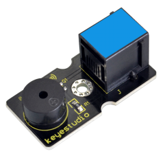
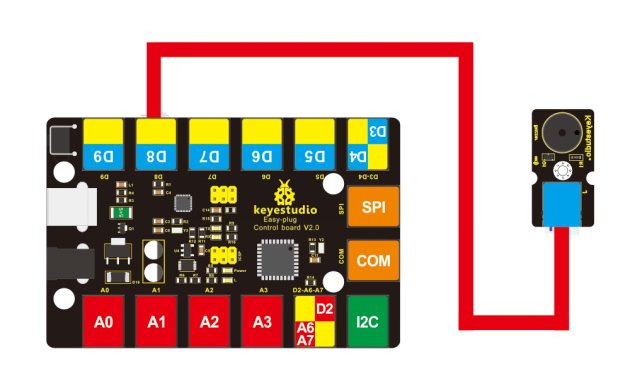
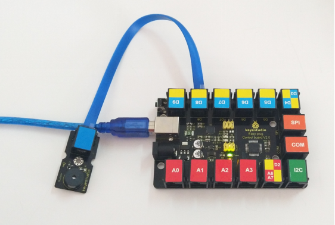

# KS0103 keyestudio EASY plug Passive Buzzer Module



## 1. Introduction

We can use Arduino to make many interactive works of which the most commonly used is acoustic-optic display.

The buzzer we introduced here is a passive buzzer. It cannot be actuated by itself, but by external pulse frequencies.

Different frequencies produce different sounds. You can use Arduino to code the melody of a song, which is quite fun and simple.

This module should be used together with EASY plug control board.

**Special Note:**

The sensor/module is equipped with the RJ11 6P6C interface, compatible with our keyestudio EASY plug Control Board with RJ11 6P6C interface.

If you have the control board of other brands, it is also equipped with the RJ11 6P6C interface but has different internal line sequence, can’t be used compatibly with our sensor/module.

## 2. Specification

- Interface: Easy plug
- Working voltage: 3.3-5V
- Sensor type: digital
- Easy to use

## 3. Technical Details

- Dimensions: 39mm * 20mm * 18mm
- Weight: 5.6g

## 4. Connect It Up

Connect the EASY Plug passive buzzer module to control board using an RJ11 cable. Then connect the control board to your PC with a USB cable.



## 5. Upload the Code

Download code :  [Code](./Code.7z)

```c
int buzzer=8;//set digital IO pin of the buzzer

void setup()
{
	pinMode(buzzer,OUTPUT);// set digital IO pin pattern, OUTPUT to be output
}

void loop()
{ 
    unsigned char i,j;//define variable
    while(1)
    { 
        for(i=0;i<80;i++)// output a frequency sound
        {
            digitalWrite(buzzer,HIGH);// sound
            delay(1);//delay1ms
            digitalWrite(buzzer,LOW);//not sound
            delay(1);//ms delay
        }
        for(i=0;i<100;i++)// output a frequency sound
        {
            digitalWrite(buzzer,HIGH);// sound
            digitalWrite(buzzer,LOW);//not sound
            delay(2);//2ms delay
        }
    }
}
```

## 6. Result

Done uploading the code, you should be able to hear the buzzer module make a small “click”.

